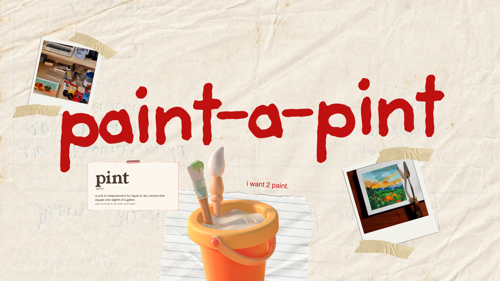
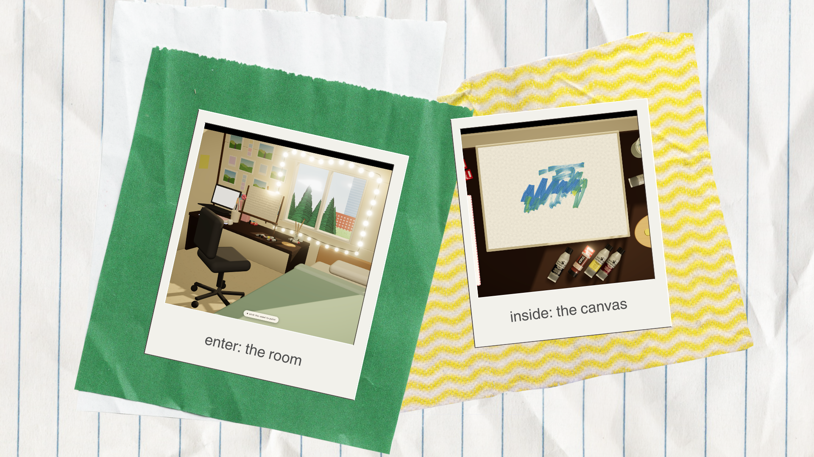
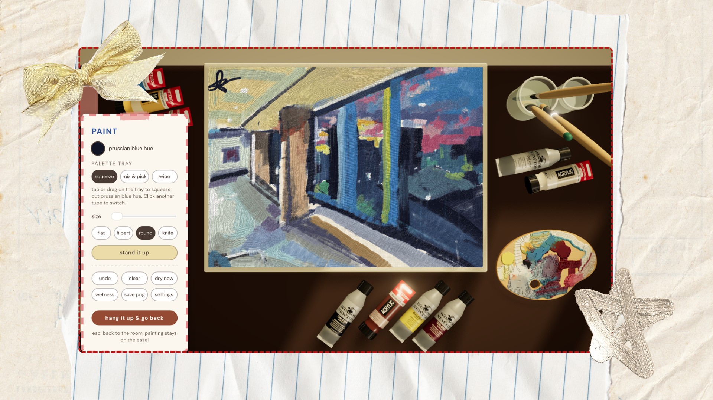

# paint-a-pint 🎨⊹°

_[Hack the North '26](https://hackthenorth2026.devpost.com/)_ Semi-Finalist by [Fay](https://faywu.ca/) (๑ᵔ⤙ᵔ๑)






## What is it?

A digital simulation of the acrylic painting experience.

## Why

It's easy for an artist to lose their home when their **heart** and **tools** are far away.

As a second year computer science student navigating early career, life undoubtly throws an endless streaem of toils that add friction to creation, but **relinquish and regression** can't be the only way.

I aimed to solve this through making the act of painting digital, without having to worry about costs, material, and negative respiratory impacts that real acrylic painting can entail.

Your work saved locally, return anytime to see your past paintings or continue on a piece.


## Built with

- Vite 8
- HTML, CSS, JavaScript
- Three.js with WebGL
- Deployed on Vercel
- Cloudflare DNS

## Local setup

**Prequisites**: A browser that can run WebGL and [Node.js](https://nodejs.org) 20.19+ or 22.12+

```bash
git clone https://github.com/wrufay/paint-a-pint
cd paint-a-pint
npm install
npm run dev
```

## Designed for

Large mobile device use (e.g. IPad with Apple Pencil) or desktop ideally paired with a drawing tablet, such as [Wacom Intuos](https://www.wacom.com/en-us/products/pen-tablets/wacom-intuos).

## Limitations

The numbers behind calculations such as that for drying times and paint thickness are **educated guesses** tuned by eye against a handfull of my own paintings.

Hence, are not true measurements and are not intended to yield exact real-world behaviour.

## Proud of

Learning some Three.js!

**Paint mixing on the canvas**: My biggest fear for this project was having it end up as a digital art tool with no differentiator, but seeing the painting mix made me feel like I was back on a real canvas.



_See the painting process [here](https://www.youtube.com/watch?v=0OMz45NClwk&feature=youtu.be) - my E7 hacking spot at sunrise_

## Layout

|                                            |                                                                                        |
| ------------------------------------------ | -------------------------------------------------------------------------------------- |
| `src/brush/engine.js`                      | the acrylic engine: JavaScript with no DOM, runs in Node                               |
| `src/brush/pigment.js`, `spectral-data.js` | pigment mixer and its generated tables                                                 |
| `src/brush/paints.js`                      | the nine paints as data (add paints here)                                              |
| `src/brush/tune.js`                        | saved settings and the settings panel                                                  |
| `src/acrylic-painter.js`                   | connects the engine to the room and the card                                           |
| `src/main.js`, `src/room.js`               | the room, easel, and the camera                                                        |
| `src/lab.js`, `lab.html`                   | brush lab: engine and raw sliders on one page                                          |
| `src/paint.js`                             | fallback: older, original gouache painter used in earlier iterations                   |
| `tools/`                                   | Node checks: `dry-test`, `mix-test`, `render-test`, `brush-shapes`, `consumption-test` |
| `docs/design/`                             | the design system comprised of tokens, type, and specimens                             |

Regenerate the pigment tables with `node tools/gen-spectral-data.mjs`. The Node checks print numbers or write PNGs, for example `node tools/brush-shapes.mjs out.png`.

## Credits

Pigment mixing tables come from [Spectral.js](https://github.com/rvanwijnen/spectral.js) by Ronald van Wijnen (MIT), used as a dev dependency to generate `src/brush/spectral-data.js`.

[Windsor & Newton Galeria](https://www.winsornewton.com/en-ca/collections/galeria-acrylic) and [Amsterdam](https://www.royaltalens.com/collections/amsterdam-standard-series-acrylics) acrylics for being the best cost affordable acrylics that carried me through years of silly painting. Reference images and **exact colour codes of paints I own** were used to generate the 3D tubes.


## What's next

- **Two books** on the desk that users can click: one an _app tutorial_ and the other an _art tutorial_. I want to share my own (minimal) expertise to make creating art more accessible, less intimidating, and ultimately **playful**.
- An **AI guide?** 💭
- **Different locations** to paint in, plus interface theme matching the local time of day.
- Right now, _paint-a-pint_ is front-end only, and that's by design to fulfill the purpose of being a **skill-builder tool**. In the future, it could become a real personal gallery - or even a shared one among friends and community members, each writing their own playbooks on tips, techniques, and thinking.

### I hope you enjoyed [_paint-a-pint_](https://paint-a-pint.vercel.app/) ⊹° Until next time...
